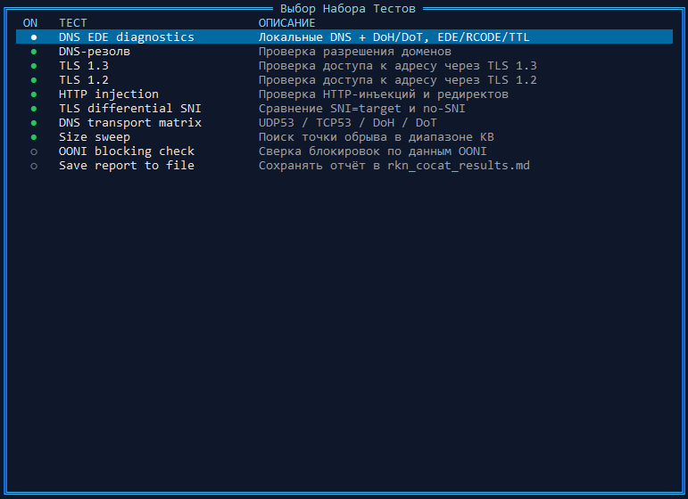
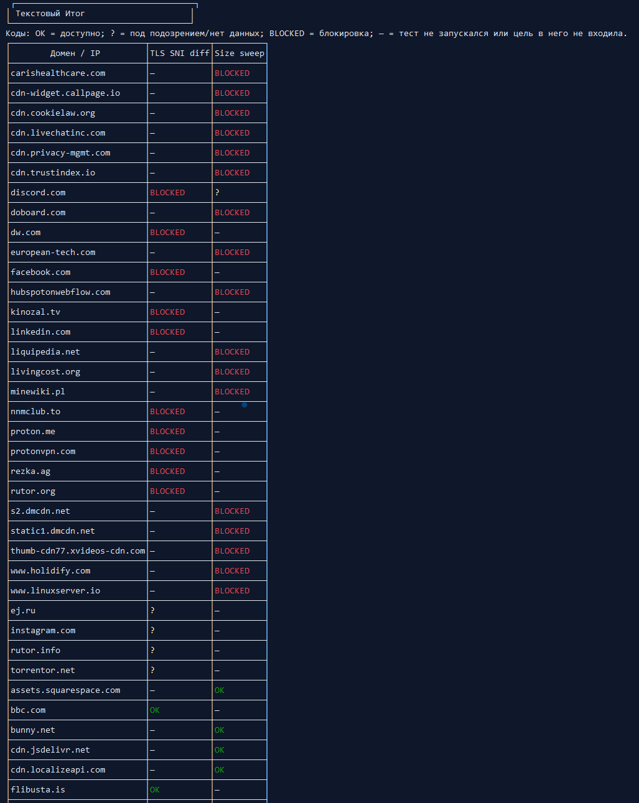
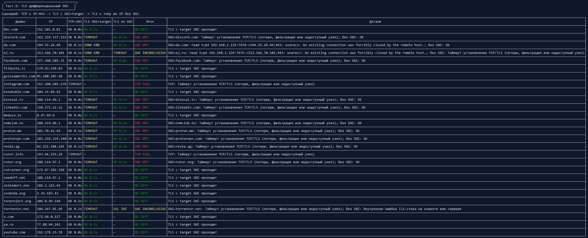
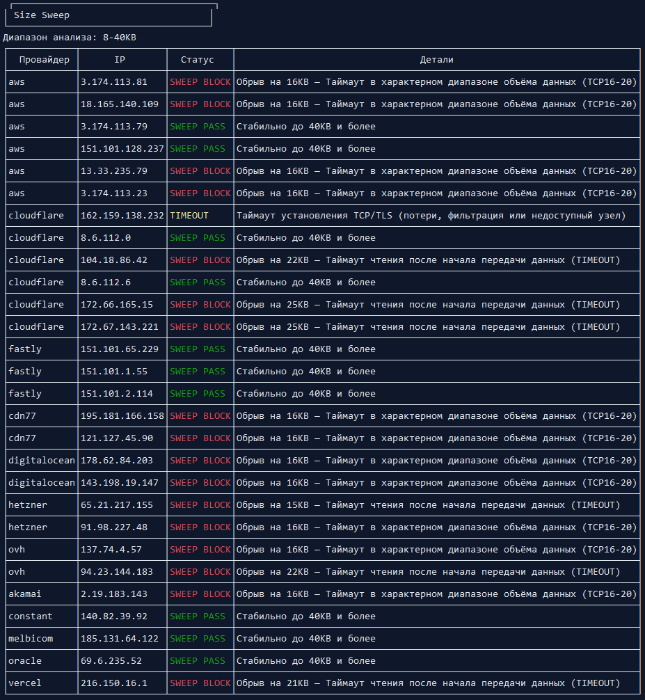

  

# ✨ RKN COCAT

Roskomnadzor Censorship Observation, Check & Analysis Tool

Программа для определения способа блокировки ресурса Роскомнадзором

  
<strong>Скриншоты</strong>

   
  
    
  
    
  
    
  

---

### ▶️ Запуск

Последнию сборку можно скачать из Releases

[Windows](https://github.com/xrAlex/rkn-cocat/releases/latest/download/rkn-cocat_windows_amd64.zip)

[Linux](https://github.com/xrAlex/rkn-cocat/releases/latest/download/rkn-cocat_linux_amd64.tar.gz)

Перед запуском пропишите в конфиги ресурсы которые хотите протестировать, по умолчанию туда вписаны базовые ресурсы которое светились в базах блокировок РКН

### 🧭 Что умеет программа

#### Проверка DNS-resolve

> Вы спрашиваете DNS: "Где живёт site.com?"
>
> - Нормальный DNS: "Вот IP 111.222.333.444"
> - Подменённый DNS: "Такого не существует, просто небыло и нет"
>
> Это как пьяный друг, который обещал привести вас в бар, но неожиданно привёл к патрулю ППС

#### Проверка TLS 1.3 и TLS 1.2

> Представьте двух шпионов: диалог начинается через секретное рукопожатие.
> В случае с TLS 1.2 вам протягивают руку, а в случае с TLS 1.3 кладут в руку что-то длинное, тёплое и фаллообразное.
> Что то тут не так

#### Тест HTTP injection

> Представьте: курьер приносит пиццу и сообщает: "Пицца запрещена, вот разрешённый гарнир"
> 
> Так и с сайтами: вы заходите на YouTube, а вам подсовывают Rutube

#### Проверка TLS differential SNI

> Вы приходите в ночной клуб, вас останавливает фейс-контроль, вы говорите: "Я просто потусить" и вас пускают
> 
> Вы приходите в ночной клуб, вас останавливает фейс-контроль, вы говорите: "Я потусить к другу Петровичу", и после этого вас выкидывают

#### Диагностика DNS EDE

> Прямолинейное предупреждение, что товарищ майор запретил вам заходить сюда

#### Тест Size sweep

> Лифт честно держит 799 кг, а на 800 кг внезапно вспоминает, что по паспорту можно только 500, и выкидывает и вас, и груз

#### Проверка DNS transport matrix

> Вы едете прямо, но вас разворачивает патрульная машина; едете налево, а там армяне играют в нарды. И только через тоннель можно проехать без преград
> 
> Прямо был UDP53, слева был TCP53, а тоннель - это DoH.

#### Проверка блокировок в базе OONI

> Парни по сути предоставили среднюю температуру по больнице: вы видите, что она растёт, и начинаете замерять у себя

---

### 📊 Коды статусов и интерпретация

#### DNS EDE diagnostics

- `VALID` / `VALID + DNS BLOCK HINT` — валидный DNS-ответ (второй вариант с признаком block hint)
- `NXDOMAIN` / `SERVFAIL` / `REFUSED` / `NOERROR EMPTY` — DNS-исходы без валидных A/AAAA
- `MIXED (...)` — A/AAAA дали разные исходы
- `DNS EDE BLOCK` — EDE указывает на блокировку/цензуру (`Blocked/Censored/Filtered/Prohibited`)
- `DNS BLOCK HINT` — DNS/CNAME/IP/EDE текст похож на направление на блок-страницу
- `BLOCKED` — транспортный deny на DNS этапе (например DoH/DoT)
- `TIMEOUT` — таймаут DNS-запроса
- `ERROR` — общая ошибка DNS-запроса/парсинга

#### DNS-резолв

- `DNS OK` — домен успешно разрешён
- `DNS FAIL` — домен не разрешился (NXDOMAIN/ошибка DNS/фильтрация DNS)
- `DNS FAKE` — резолвинг указывает на IP-заглушку/блок-IP из набора

#### TLS 1.3 / TLS 1.2

- `OK` — явных признаков блокировки не найдено
- `BLOCKED` / `ISP PAGE` — `HTTP 451` или редирект/контент похож на блок-страницу
- `TLS DPI` / `TLS MITM` / `TLS BLOCK` / `TLS ERR` — вмешательство в TLS, подмена сертификата, блок по TLS-профилю или общий TLS-сбой
- `SSL CERT` / `SSL ERR` / `SSL INT` — ошибки сертификата и TLS/SSL-стека
- `TCP RST` / `TCP ABORT` / `REFUSED` — соединение сброшено/прервано/отклонено
- `TIMEOUT` — таймаут подключения или чтения
- `CONN FAIL` / `CONN ERR` — ошибка подключения без более узкой классификации
- `NET UNREACH` / `HOST UNREACH` — недоступен маршрут до сети/хоста
- `CONFIG ERR` — некорректные параметры конфигурации

#### HTTP injection

- `OK` / `REDIR` — штатный HTTP-ответ или редирект
- `BLOCKED` / `ISP PAGE` — `HTTP 451` или признаки страницы ограничения доступа
- `DNS FAIL` — DNS не разрешил домен
- `TCP RST` / `REFUSED` / `TIMEOUT` — TCP-сбой/отклонение/таймаут на HTTP этапе
- `CONN FAIL` / `CONN ERR` — ошибка подключения без более узкой классификации
- `NET UNREACH` / `HOST UNREACH` — недоступен маршрут до сети/хоста
- `CONFIG ERR` — некорректные параметры запроса

#### TLS differential SNI

- `SNI DPI` — TCP к IP:443 проходит, `SNI=target` рвётся, а handshake без SNI проходит
- `SNI INCONCLUSIVE` — `SNI=target` не проходит, но без SNI тоже не проходит
- `NO DIFF` — заметной разницы между `SNI=target` и без SNI нет
- `TCP FAIL` — базовый TCP к IP:443 не прошёл, поэтому SNI-вердикт ограничен
- `OK`, `TLS DPI`, `TIMEOUT`, `TCP RST`

#### DNS transport matrix

- `ALL OK` — все транспорты (UDP/TCP/DoH/DoT) дали валидный результат
- `PARTIAL` — работает только часть транспортов
- `BLOCKED` — по транспорту нет `OK/NXDOMAIN` исходов
- `OK <ip>`, `NXDOMAIN`, `TIMEOUT`, `ERROR`

#### Size sweep

- `SWEEP PASS` — поток стабилен до верхней границы size sweep
- `SWEEP BLOCK` — обрыв внутри sweep-окна (признак фильтрации по объёму)
- `SWEEP OUTSIDE` — обрыв есть, но вне sweep-диапазона
- `SWEEP ERR` — нераспознанный/пустой итог sweep
- `DNS FAIL` / `DNS FAKE` — проблемы DNS/подмена перед sweep
- `CONFIG ERR` — некорректные параметры sweep/URL
- `TIMEOUT`, `CONN FAIL`, `CONN ERR`, `REFUSED`, `TCP RST`, `TCP ABORT`

#### OONI block check

- `OK` — в OONI `web_connectivity` нет явного сигнала блокировки
- `BLOCKED` — OONI вернул тип блокировки (`blocking=<reason>`)
- `TCP_REACHABLE` — через fallback `tcp_connect` IP достигается (порты из `ooni_tcp_ports`)
- `TCP_FAIL` — `tcp_connect` неуспешен (может быть блокировка или сетевой сбой)
- `NO_DATA` / `UNKNOWN` — по OONI недостаточно данных для уверенного вывода

---

### 📁 Файлы данных

Все IP/DNS/домены/таргеты задаются через YAML-файлы:

- `configs/tests/domains.yaml` — список доменов
- `configs/tests/ips.yaml` — IP-наборы
- `configs/tests/dns.yaml` — DNS резолверы/транспорты для DNS EDE и DNS matrix
- `configs/tests/cdn.yaml` — цели для Size sweep

### 🙏 Благодарности

- [PETS](https://www.petsymposium.org/foci/2024/foci-2024-0001.pdf)
- [IMC](https://ensa.fi/papers/tspu-imc22.pdf)
- [OONI](https://ooni.org/ru/post/2024-russia-report/)
